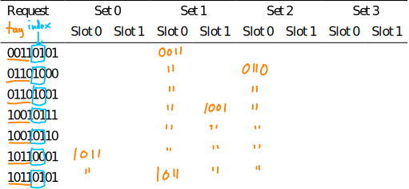

# Exam 2 practice questions

## A: Code optimization, performance

**A1)**

Consider the following function:

```c
// combine a collection of strings into a single string
char *combine(const char *strings[], unsigned num_strings) {
  // determine amount of space needed
  size_t total_size = 0;
  for (unsigned i = 0; i < num_strings; i++) {
    total_size += strlen(strings[i]);
  }

  // allocate buffer large enough for all strings
  char *result = malloc(total_size + 1);

  // copy the data into the buffer
  result[0] = '\0';
  for (unsigned i = 0; i < num_strings; i++) {
    strcat(result, strings[i]);
  }

  return result;
}
```

Explain the performance problem with this function and how to fix it.

*Possible answer*:

The problem is potential O(N<sup>2</sup>) running time when a large number of
small strings are combined.  The problem is that `strcat` repeatedly has to look
for the NUL terminator in the `result` buffer, an O(N) operation which
is called in a loop.  Note here that *N* is the combined length of all of
the strings.

This can be fixed by keeping track of where the NUL terminator in the result buffer
is, and appending each string's data in the correct position (without requiring
a loop to find that position.)  For example:

```c
// combine a collection of strings into a single string
char *combine(const char *strings[], unsigned num_strings) {
  // determine amount of space needed
  size_t total_size = 0;
  for (unsigned i = 0; i < num_strings; i++) {
    total_size += strlen(strings[i]);
  }

  // allocate buffer large enough for all strings
  char *result = malloc(total_size + 1);

  // copy the data into the buffer
  char *dest = result;
  for (unsigned i = 0; i < num_strings; i++) {
    for (unsigned j = 0; strings[i][j] != '\0'; j++) {
      *dest = strings[i][j];
      dest++;
    }
  }

  // add final NUL terminator
  *dest = '\0';

  return result;
}
```

**A2)**

Consider the following C code (assume that all variables have the type
`uint64_t`):

```c
a = b * c;
d = e * f;
g = h * i;
j = a * d * g;
```

Assume that

* the CPU is superscalar
* all of the variables refer to CPU registers
* the CPU has two integer multipliers, each of which is fully pipelined
* a single multiplication requires 3 cycles

What is the mininum number of cycles required for the computation to complete?
Justify your answer.

*Possible answer*:

The multiplications computing `a`, `d`, and `g` are independent.
The multiplication computing `j` is dependent on all three of the
earlier mulitplications, and itself requires two multiplications with
a data dependency.

Rewriting the code slightly to introduce a temporary to make the
data dependence in the computation of j explicit, we have:

```c
a = b * c;
d = e * f;
g = h * i;
t = a * d;
j = t * g;
```

Given two integer multipliers with 3 stage pipelines,
utilization could look like this:

```
   Time:   0    1    2    3    4    5    6    7    8    9   
          -------------------------------------------------
        / b*c  h*i       a*d            t*g           [result]
Unit 1 |       b*c  h*i       a*d            t*g
        \           b*c  h*i       a*d            t*g
        / e*f
Unit 2 |       e*f
        \           e*f
```

Thus, it is possible to complete the computation in 9 cycles, if
the `b*c` and `e*f` multiplications both start on cycle 0.

## B: Caches

**B1)**

Assume a system with 32 bit addresses has a direct mapped cache with 256 KB 
total capacity (2<sup>18</sup> bytes) and a 32 byte block size.
Show the format of an address, indicating which bits are offset, index, and tag.

*Answer*:

32 = 2<sup>5</sup>, so 5 offset bits

Number of blocks in the cache is 2<sup>18</sup> / 2<sup>5</sup> = 2<sup>13</sup>, so 13 index bits

32 - 13 - 5 = 14, so 14 tag bits

Thus,

Tag     | Index   | Offset
------- | ------- | ------
14 bits | 13 bits | 5 bits

**B2)**

Assume a system with 32 bit addresses has a 4-way set associative cache
with 512 KB total capacity (2<sup>19</sup> bytes) and a 64 byte block size.
Show the format of an address, indicating which bits are offset, index, and tag.

*Answer*:

64 = 2<sup>6</sup>, so 6 offset bits

Number of blocks in the cache is 2<sup>19</sup> / 2<sup>6</sup> = 2<sup>13</sup>

With 4 = 2<sup>2</sup> blocks per set, number of sets is 2<sup>13</sup> / 2<sup>2</sup> = 2<sup>11</sup>, so 11 index bits

32 - 11 - 6 = 15, so 15 tag bits

Thus,

Tag     | Index   | Offset
------- | ------- | ------
15 bits | 11 bits | 6 bits

**B3)**

Assume a system with 32 bit addresses and a fully associative cache with 512 KB
total capacity (2<sup>19</sup> bytes) and a 64 byte block size.
Show the format of an address, indicating which bits are offset, index, and tag.

*Answer*:

64 = 2<sup>6</sup>, so 6 offset bits

Since it's fully associative, there are no index bits, so the number of tag bits is 32 - 6 = 26

Thus,

Tag     |  Offset
------- |  ------
26 bits |  6 bits

**B4)**

Consider use of a 2-way associative cache that addresses blocks of 4 bytes,
with 4 sets in a 8-bit address space.

(a) How are the 8 bits of the address used as tag, index, and offset for the cache?

*Answer*:

Blocks are 4 = 2<sup>2</sup> bytes, so 2 offset bits

There are 4 = 2<sup>2</sup> sets, so 2 index bits

Remaining 4 bits are tag

Thus,

Tag    | Index  | Offset
------ | ------ | ------
4 bits | 2 bits | 2 bits

(b) Consider a following sequence of requests to the cache.
Enter the tag for each cache slot after each request in the table below. Assume FIFO as
caching strategy (do not worry about internal bookkeeping of timestamps). Note: use &#34;
to indicate that the value in the slot is identical to the previous value.

<table>
  <tr>
   <td>Request</td>
   <td colspan="2" style="text-align: center;">Set 0</td>
   <td colspan="2" style="text-align: center;">Set 1</td>
   <td colspan="2" style="text-align: center;">Set 2</td>
   <td colspan="2" style="text-align: center;">Set 3</td>
  </tr>

  <tr style="border-bottom: 1px solid;">
   <td></td>
   <td>Slot 0</td>
   <td>Slot 1</td>
   <td>Slot 0</td>
   <td>Slot 1</td>
   <td>Slot 0</td>
   <td>Slot 1</td>
   <td>Slot 0</td>
   <td>Slot 1</td>
  </tr>

  <tr><td>00110101</td><td></td><td></td><td></td><td></td><td></td><td></td><td></td><td></td></tr>
  <tr><td>01101000</td><td></td><td></td><td></td><td></td><td></td><td></td><td></td><td></td></tr>
  <tr><td>01101001</td><td></td><td></td><td></td><td></td><td></td><td></td><td></td><td></td></tr>
  <tr><td>10010111</td><td></td><td></td><td></td><td></td><td></td><td></td><td></td><td></td></tr>
  <tr><td>10010110</td><td></td><td></td><td></td><td></td><td></td><td></td><td></td><td></td></tr>
  <tr><td>10110001</td><td></td><td></td><td></td><td></td><td></td><td></td><td></td><td></td></tr>
  <tr><td>10110101</td><td></td><td></td><td></td><td></td><td></td><td></td><td></td><td></td></tr>
</table>

*Answer*:

<div style="margin-left: 2em;">
  
</div>

## C: Linking, shared libraries

**C1)** Here is the disassembly of a function called `hex_write_string`, as observed in a non-position-independent executable (`asm_hextests`):

```
0000000000400904 <hex_write_string>:
  400904:       41 54                   push   %r12
  400906:       49 89 fc                mov    %rdi,%r12
  400909:       e8 b9 ff ff ff          callq  4008c7 <str_len>
  40090e:       48 89 c2                mov    %rax,%rdx
  400911:       bf 01 00 00 00          mov    $0x1,%edi
  400916:       4c 89 e6                mov    %r12,%rsi
  400919:       b8 01 00 00 00          mov    $0x1,%eax
  40091e:       0f 05                   syscall 
  400920:       41 5c                   pop    %r12
  400922:       c3                      retq   
```

This function uses the `write` system call to print a NUL-terminated string value to standard output.

Note that in the encoding of the `callq` instruction, the address of the function being called is specified by a signed 32 bit offset, which is relative to the address of the instruction following the `callq` instruction.  Observe that the bytes B9 FF FF FF, when interpreted as a little endian signed two's complement integer, encode the value -71, and subtracting 71 from the address of the successor of the `callq` instruction, 0x40090E, yields 0x4008C7, the exact address of the called function.

What are some advantages of encoding the address of a called function as a relative displacement rather than an absolute address?  What are some disadvantages?

**Possible answer:**

One advantage of implementing calls as relative displacements is that the call is automatically position-independent, i.e., the code can be loaded anywhere in the virtual address space, and the relative calls will work correctly.  Main disadvantage: an addition to the instruction pointer value is required (hardware implementation is slightly more complicated than if the target address were absolute).

**C2)** Let's say that you have a Linux executable that you don't have the source code for, and you want to change its behavior so that whenever it tries to open a file, it will be forced to look in a particular directory.  For example, if the process wants to open the file `foobar.txt`, it will actually open `/tmp/look_here/foobar.txt`.  What would be an easy way to accomplish this that doesn't require any modifications to the executable or any system libraries?  You may assume that all files will be opened via calls to the `open` function in the shared C library, which is a wrapper for the `open` system call.

**Possible answer:**

Implement a shared library that defines an `open` function which does the desired transformation on the pathname, and then calls the "real" `open` system call, either by calling the wrapper function in the shared C library (`dlopen` and `dlsym` can be used to get the address of this function), or by using a `syscall` instruction.  This shared library can then be interposed using `LD_PRELOAD`, so that calls to `open` in the executable are redirected to the "instrumented" version of `open` in the shared library we created.

## D. Exceptions and processes

**D1)** Consider the following function:

```c
uint64_t sum_array(uint32_t arr[], unsigned len) {
  uint64_t sum = 0;
  for (unsigned i = 0; i < len; i++) {
    sum += arr[i];
  }
  return sum;
}
```

Assume that this function is called to find the sum of the elements in a very large (hundreds of millions of elements.)  State some possible reasons why the process executing this function might be suspended and resumed during the execution of the function.

**Possible answer**:

This loop is entirely computational, i.e., it doesn't invoke any system calls, so there are no "voluntary" transitions into the OS kernel.

Some reasons why such a transition might occur include:

* The timer interrupt was handled, and the OS kernel chose to execute a different process
* A hardware device raised an interrupt, e.g., a disk I/O request completed, and the OS kernel chose to activate the process which requested the I/O
* A page fault occurred (if the array is large, then it might not be entirely mapped into virtual memory); if disk I/O is needed to handle the page fault, the OS kernel might switch to another process

**D2)** Most operating systems use a periodic timer interrupt to ensure that the OS kernel is able to make scheduling decisions on a regular basis.  I.e., the timer interrupt handler can ensure that no process is able to have exclusive use of a CPU core for an indefinite period of time.

Assume a uniprocessor (single core) system in which the timer interrupt occurs at fixed intervals.  State some advantages and disadvantages of making the timer interval longer rather than shorter.

**Possible answer**: Switching from one process to another has a cost (e.g., TLB misses because of switching to a different virtual address space.)  A longer "quantum" (the interval between timer interrupts) reduces the overall context switch overhead because context switches occur less frequently.  The disadvantage is that a computationally-intensive process may "hog" the CPU, making the system less responsive.

## E. Signals

**E1)** On Linux, the `printf` function is not "async signal safe", which means that it can't be called safely from a signal handler function.  Describe a scenario where calling `printf` from a signal handler function might result in undesirable program behavior.

**Possible answer**:

`printf` is hard-coded to write to `stdout`, which is essentially a global pointer to a `FILE` object.  The `FILE` object includes a buffer and fields which indicate how much of the buffer is used.  If a signal arrives at a time when the "main program" is in a call to `printf`, the buffer and fields in the `FILE` object `stdout` points to might be in an inconsistent state, and so calling `printf` again from the signal handler might result in erratic behavior, since `stdout` is in an inconsistent state.

## F. Virtual memory

**F1)** Consider the following function:

```c
uint32_t sum_up_to(unsigned n) {
  uint32_t sum = 0;
  for (unsigned i = 1; i <= n; i++) {
    sum += i;
  }
  return sum;
}
```

Assume that all of the variables in this function (`n`, `sum`, and `i`) are allocated by the compiler as CPU registers, so that there are no memory references in the assembly code generated for this function.  Is it possible for any page faults to occur as a result of executing this function? Briefly explain why or why not.

**Possible answer**:

Page faults could definitely occur due to instruction fetches, if the code for the instructions implementing the loop are in a virtual page which is not currently mapped to a physical page.

**F2)** Say that you have a CPU with 64 bit virtual addresses and a 16K (2<sup>14</sup> bytes) page size.  Assume that page table entries (at all levels of the page table hierarchy) are the same size as addresses, i.e., 8 bytes.

(a) If the full 64 bit address space is usable, how many levels of page tables are necessary?

**Possible answer**:

The page offset will be 14 bits.  64 - 14 is 50.  Each 16K page has room for 2<sup>11</sup> = 2048 page table entries, so the index at each level will be 11 bits.  We will thus need at least 5 levels of page tables (not counting the physical pages as a level); 4 levels would not be sufficient because that would only correspond to 44 bits of the virtual page number.

(b) Show a proposed format for a virtual address, assuming that the entire 64 bit virtual address space is usable, showing the ranges of address bits used for the page offset and the index at each level of the hierarchy.

**Possible answer**:

Level 0 index | Level 1 index | Level 2 index | Level 3 index | Level 4 index | Page offset
:-----------: | :-----------: | :-----------: | :-----------: | :-----------: | :---------:
10 bits       | 10 bits       | 10 bits       | 10 bits       | 10 bits       | 14 bits

Note that we would only be using half of the available entries at each level.  Also, it might make more sense to use a format such as

Level 0 index | Level 1 index | Level 2 index | Level 3 index | Level 4 index | Page offset
:-----------: | :-----------: | :-----------: | :-----------: | :-----------: | :---------:
6 bits        | 11 bits       | 11 bits       | 11 bits       | 11 bits       | 14 bits

(c) Explain why, from a practical standpoint, it might be a good idea to support an effective virtual address space of less than 2<sup>64</sup> bytes.

**Possible answer**:

The more levels in the hierarchy, the higher the cost of handling a TLB miss.  Since 2<sup>64</sup> is a truly enormous amount of virtual address space, it might make sense to reduce the effective size of the virtual address space in favor of having fewer levels of hierachy.  For example, with 4 levels and a 16 KB page size, the effective size of the virtual address space would be 2<sup>44+14</sup> = 2<sup>58</sup>.

**D3)** On x86-64 systems, there are four levels of page tables, with each page table having 512 (2<sup>9</sup>) entries.  The page size is 4096 (2<sup>12</sup>) bytes.  This scheme provides an effective virtual address size of 2<sup>48</sup> bytes, since

<blockquote>
2<sup>9</sup> × 2<sup>9</sup> × 2<sup>9</sup> × 2<sup>9</sup> × 2<sup>12</sup> = 2<sup>48</sup>
</blockquote>

**F3)** On x86-64 systems, there are four levels of page tables, with each page table having 512 (2<sup>9</sup>) entries.  The page size is 4096 (2<sup>12</sup>) bytes.  This scheme provides an effective virtual address size of 2<sup>48</sup> bytes, since

<blockquote>
2<sup>9</sup> × 2<sup>9</sup> × 2<sup>9</sup> × 2<sup>9</sup> × 2<sup>12</sup> = 2<sup>48</sup>
</blockquote>

(a) In the *page directory*, which is the page table at the root of the tree, how much virtual address space (in bytes) does each entry represent?

**Possible solution**:

There are 512 (2<sup>9</sup>) entries in the page directory, so each one controls 2<sup>48</sup> / 2<sup>9</sup> = 2<sup>39</sup> bytes of the virtual address space.

(b) What is the total number of second level, third level, and fourth level page tables that could be reached from a single entry in the page directory?  How many bytes of physical memory are required if all of these page tables are present?

**Possible solution**:

For each entry in the page directory there could be:

* 1 second level page table
* 512 third level page tables
* 512 × 512 = 262,144 fourth level page tables

If fully populated, these would require (1 + 512 + 262,144) × 4096 = 1,075,843,072 bytes.  This would be a great deal of memory, but since virtual adddress spaces are typically sparse, this situation is unlikely to arise in practice.

