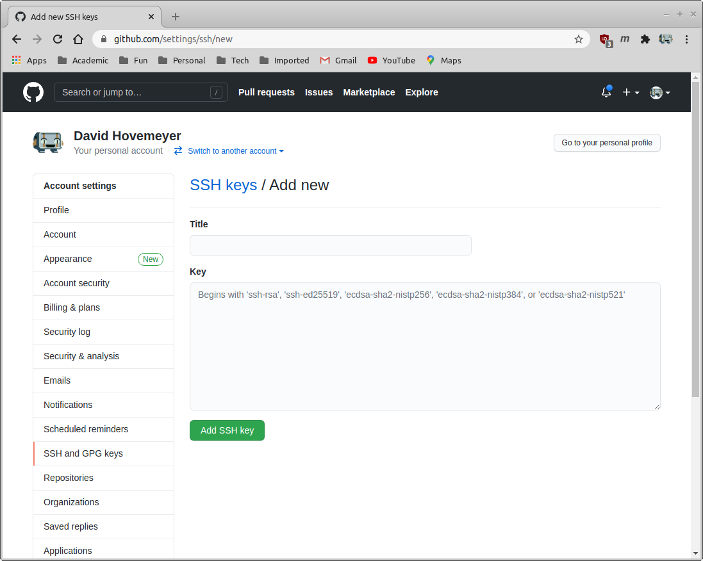
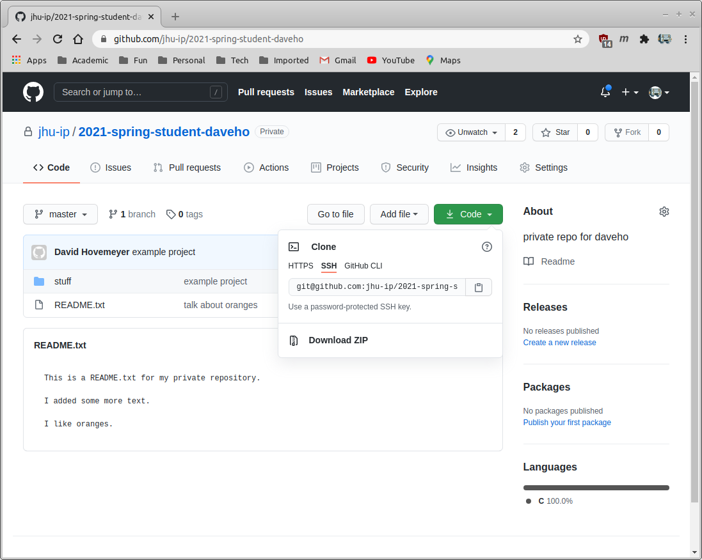
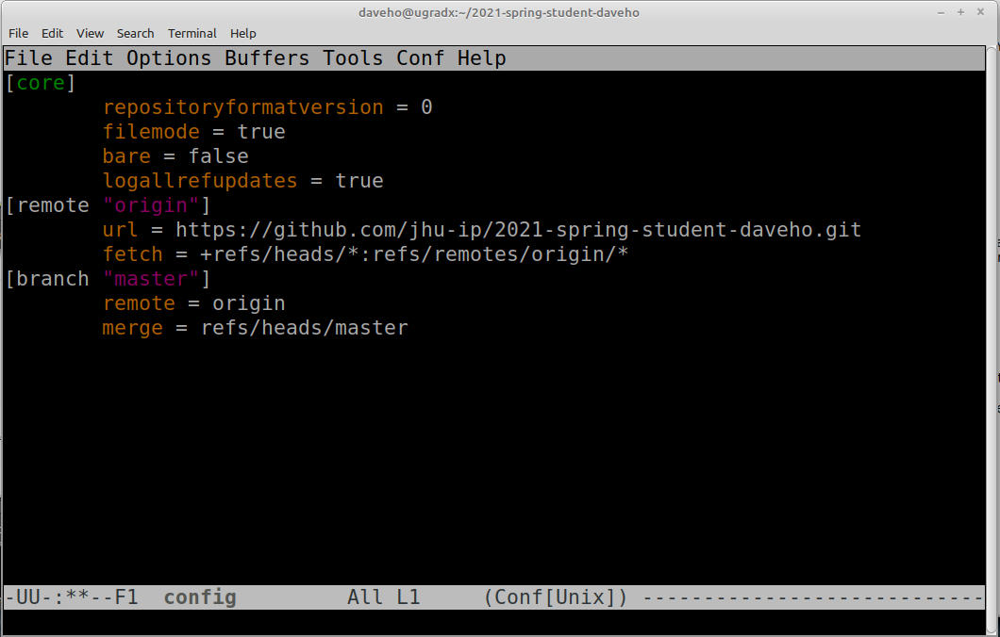
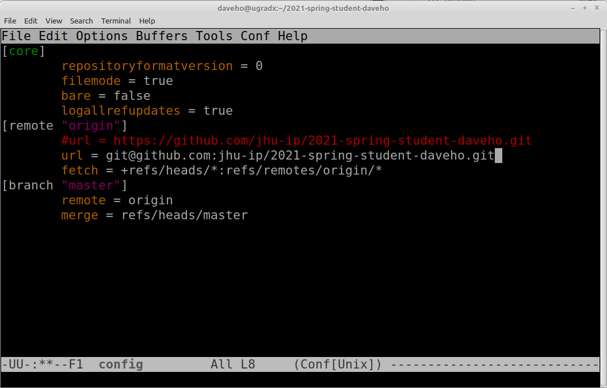

This document explains how you can create an SSH public/private keypair
for your ugrad account and configure your private repository to have Git
communicate with the remote server using SSH. Doing this will avoid the
need for you to type your Github username and password every time you do
a remote operation such as <code>git pull</code> or <code>git push</code>.

We recommend that you read and follow these instructions carefully. If
you follow them exactly, they should work.

Please note that configuring your Github account and private repository
to use SSH is <strong>completely optional</strong>. If you would prefer
to use HTTPS and use your Github username and password to authenticate,
that is perfectly fine.

## Creating an ssh public/private keypair

The first step you will need to do is to log into your ugrad account
and run the following command:

```bash
ssh-keygen -t rsa -b 2048
```

When prompted for the file and passphrase, just hit "Enter" to accept the default option.
The output you should see in your terminal should look something like this:

```
[daveho@ugradx ~]$ ssh-keygen -t rsa -b 2048
Generating public/private rsa key pair.
Enter file in which to save the key (/home/daveho/.ssh/id_rsa): 
Created directory '/home/daveho/.ssh'.
Enter passphrase (empty for no passphrase): 
Enter same passphrase again: 
Your identification has been saved in /home/daveho/.ssh/id_rsa
Your public key has been saved in /home/daveho/.ssh/id_rsa.pub
The key fingerprint is:
SHA256:STViaCEiEfnG/GXLBNJtN89FlIo+R6GDEvq0SQs+hx4 daveho@ugradx
The key's randomart image is:
+---[RSA 2048]----+
|++.....oo ooo.   |
|....+.=.oo..o    |
| + o = o.* +     |
|  B + =.+.=      |
| o B X oSo       |
|  E B o o .      |
| . +     o       |
|  .              |
|                 |
+----[SHA256]-----+
```

The `ssh-keygen` command will create a directory in your Linux home directory called
`.ssh`.  Make sure that this directory is only accessible by you by running the
command

```bash
ls -ld ~/.ssh
```

You should see output something like the following:

```
[daveho@ugradx ~]$ ls -ld ~/.ssh
drwx------. 2 daveho users 4 Jan 31 16:55 /home/daveho/.ssh
```

The permissions `rwx------` mean that only your account can read, write, or
execute (search) the contents of the `.ssh` directory, which is what you
want to see.  If you see different permissions, you can fix them by running the command

```bash
chmod 0700 ~/.ssh
```

## Copy your public ssh key to the clipboard

Print the contents of your ssh public key by running the command

```bash
cat ~/.ssh/id_rsa.pub
```

You should see something like the following (it will probably appear as multiple
lines of output in the terminal, but it's really one long line of text):

```
ssh-rsa AAAAB3NzaC1yc2EAAAADAQABAAABAQCqX2atYK7RtuODlxYZ52TpD1abeA7UxUXk4W39ZKKy3n0bguLOzNOveJNiF7ayGtbirGNBVC/f8snNGpFa8EVjW1Wx+yAVBU0sEAz4h1cYarGUNBhr+SgwGbpFHRDjptkkFpfUu6YoAkY6wv4u4s3396EHR0IttUdOqke9OIKt1nQwr1y30qpyXwLj8nd9s4frmFI4Zo/+Gyux1kYX2kg5C8Iao54HDqTRwSbfww/1KANfF3mjfLI9CI/B5y6C4e+JRa4qoN0dAVJxEeyjo3DztdDm18G1vy2Mo4Od7TvjvA2FirDFnonMknd4QoH0tlwtxk4xzFXjZSW2xEEPWxu9 daveho@ugradx
```

Copy the exact text of the public key **that you see in your terminal** to the clipboard.
In Putty, the text you select is automatically copied to the clipboard.  In the MacOS Terminal,
Command-C copies selected text to the clipboard.  In most Linux terminal programs,
Control-Shift-C copies selected text to the clipboard.
Do **not** copy the example key shown above, it will definitely not work.

## Add the public key to your Github account settings

In a web browser, go to [github.com](https://github.com) and log in.  Click the menu icon in the
upper right-hand corner of the window, and choose "Settings".  Click on "SSH and GPG keys".
Click "New SSH key".  You should see something like the following:

<span class='content-image'>

</span>

Paste the copied ssh public key to the "Key" text box, and enter a name for the
key in the "Title" text box.  This might look something like this:

<span class='content-image'>

</span>

Now click "Add SSH key" to add the SSH key to your account settings.  You will be
prompted to enter your Github account password to confirm the change.

## Using the SSH repository URL for your private Github repository

Go to the Github web page for whichever Github private repository
you would like to access, and click on "Code". You should
see something like the following:

<span class='content-image'>

</span>

Click "SSH" so that you see the SSH repository URL. You should see something like this:

<span class='content-image'>

</span>

Copy the private Github URL to the clipboard.

## Changing your cloned private repository to use SSH authentication

The last thing you will need to do is to change the local clone of your private
repository to use SSH rather than HTTPS to access the remote origin repository.
In your ugrad account, run the following commands:

```
cd ~
cd PRIVATE-REPO-NAME
```

Replace `PRIVATE-REPO-NAME` with the full name of your private Github repository.
This will be something like `2021-spring-student-IDENT` where `IDENT` is your
JHED ID or a similar unique identifier.

Now edit the `.git/config` file within your private repository by running the
following command:

```bash
emacs .git/config
```

You should see something like the following:

<span class='content-image'>

</span>

Comment out the line beginning `url =` by prefixing it with a `#` character, and add
a new `url =` line with the SSH repository URL.  This should look something like
the following:

<span class='content-image'>

</span>

Save the file by typing **Control-X** followed by **Control-S**.  The exit
Emacs by typing **Control-X** followed by **Control-C**.

Now, you are ready to test access to your remote repository using ssh.
Run the command

```bash
git pull
```

If the `git pull` command runs without prompting you to enter a password, congratulations,
you are now using SSH to access your remote repository.  All subsequent `git pull` and
`git push` commands will execute without prompting you for a username and password.
